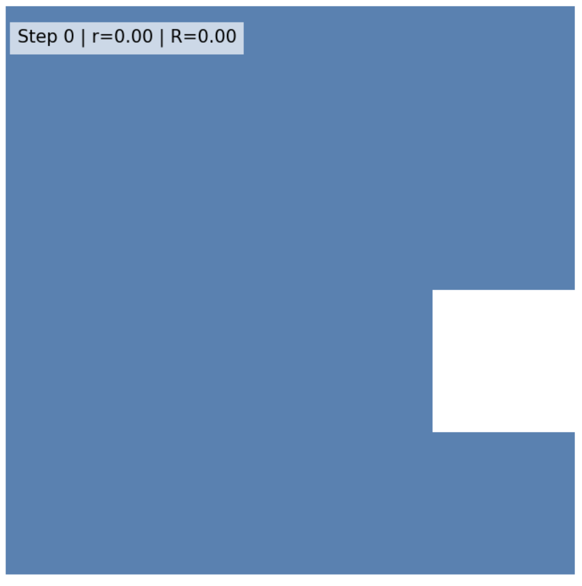
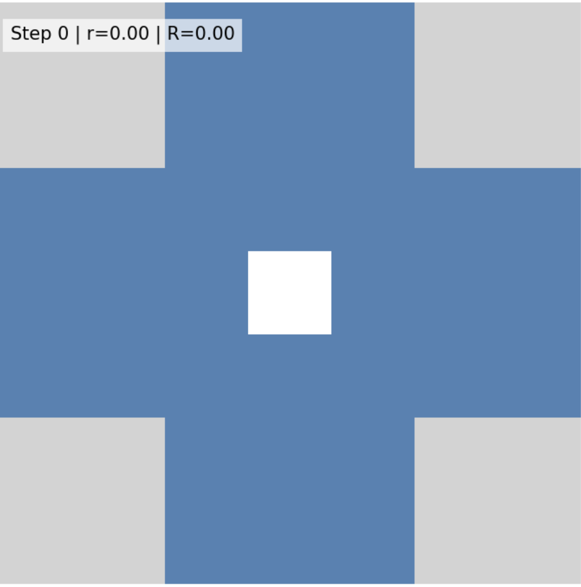
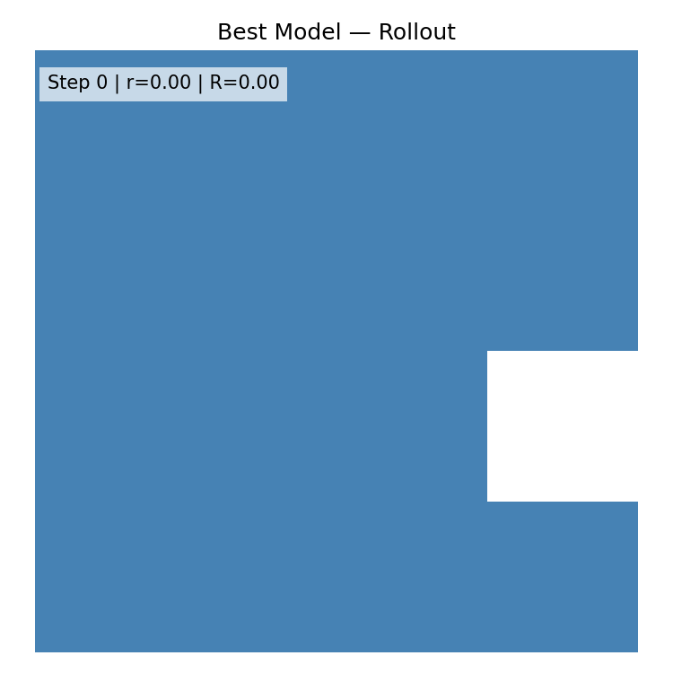
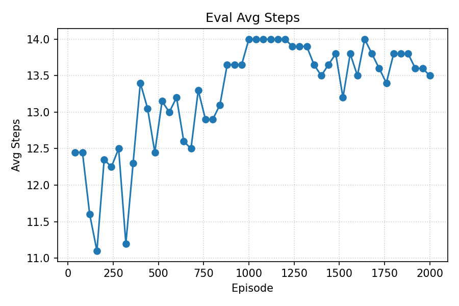
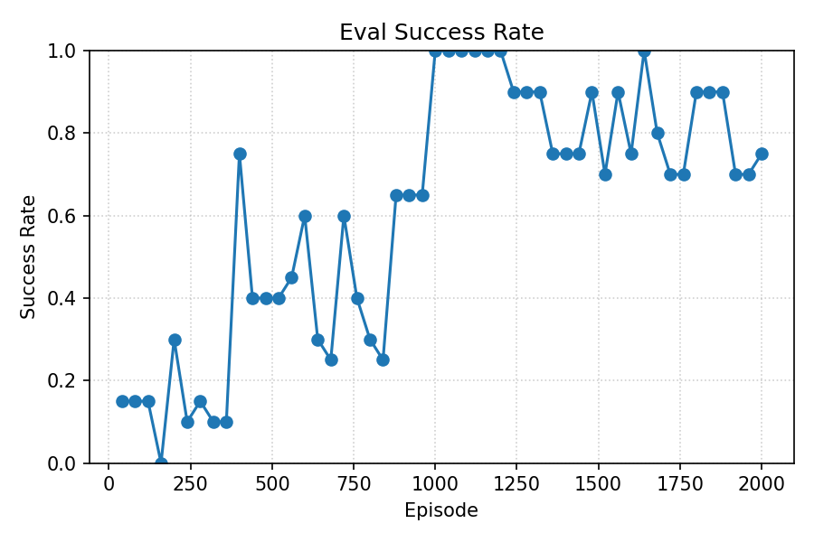
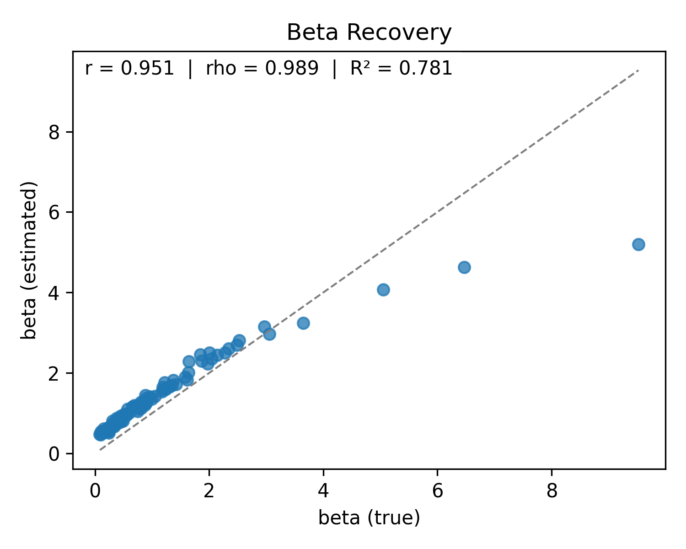

# Experiments

## Experiment Overview

- Components: RL Agent Training, Data Generation, Estimation.

### RL Agent Training

- Algorithm: DQN with replay buffer, epsilon–greedy exploration, and periodic target network synchronization.
- Environment: discrete-action env with legal action masks; observations are flattened boards.
- Evaluation: periodic greedy evaluation reports `success_rate` and `avg_steps` (higher is better here due to monotonic, no‑rollback dynamics); optional final PNG/GIF render of the best policy rollout.
- Model selection: we keep the best checkpoint rather than the last one (selected by maximizing evaluation metrics — primarily `success_rate`, with `avg_steps` as a secondary criterion under the monotonic setting).

### Data Generation

- Source policy: load a trained checkpoint.
- Behavior model: masked softmax over Q-values, $π(a|s, β) ∝ \exp(β·Q(s,a))$ on legal actions; $β$ is per-participant (lognormal or fixed).

### Estimation

- Objective: jointly estimate per-participant inverse temperatures ($β$) and a shared $Q(s, a)$ from generated trajectories.
- Method: alternating updates — E‑step (Newton updates on $z = \log β$ with Gaussian prior), M‑step (optimize $Q$ by behavior NLL with soft Bellman and CQL regularizers). Policy head can use $Q$ directly or normalized advantages.

## Environment: Peg Solitaire

| **4×4 full** | **7×7 English (33-hole cross)** |
| ------------ | ------------------------------: |
|

|

|

| Board                           | Holes (H) | State upper bound ($2^H$) | Required jumps to finish ($d=H-1$) | Implications for RL                                                                                                                                                                                 |
| ------------------------------- | --------: | ------------------------: | ---------------------------------: | --------------------------------------------------------------------------------------------------------------------------------------------------------------------------------------------------- |
| **4×4 full**                    |        16 |                    65,536 |                                 14 | Small MDP; easy to enumerate; dense-enough transitions; DQN/Tabular feasible; quick convergence; curriculum seed.                                                                                   |
| **7×7 English (33-hole cross)** |        33 |                   ≈ 8.6e9 |                                 31 | Large horizon + sparse terminal reward; exploration hard; heavy dependence on heuristic shaping, good features, or model-based planning; offline RL needs broad coverage and invariance-aware data. |

### 4×4 Peg Solitaire

#### Phase 1: RL Agent Training

- Best policy rollout (qualitative): the agent consistently solves the 4×4 board under monotonic dynamics (no rollback). The rollout illustrates a valid long‑horizon solution learned by the policy.

  
  

- Training dynamics: as training progresses, average steps increase (better in this setting without rollback) and success rate rises toward 100%. Together, these trends indicate stable learning and effective policy improvement under greedy evaluation.

  

  

#### Phase 3: Estimation

We estimate participant ability (inverse temperature) and compare it with ground truth. Summary metrics for the scatter plot:

- Pearson r: 0.951
- Spearman r: 0.989
- MAE: 0.447
- MAPE: 0.942
- Median absolute error: 0.389
- R²: 0.781

Brief analysis: both Pearson and Spearman are very high, showing strong alignment and, in particular, correct ranking of participants’ abilities. R² is lower mainly due to an outlier at the high end of the scale, which disproportionately increases squared error; despite this, the ordering is well recovered.

  

### 7x7 Peg Solitaire

TODO
